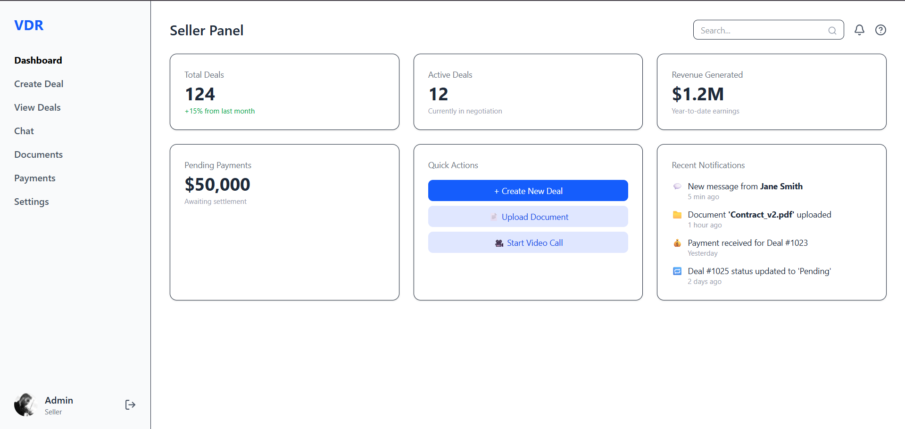
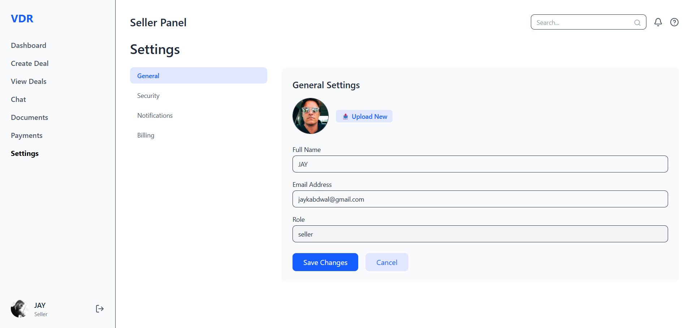
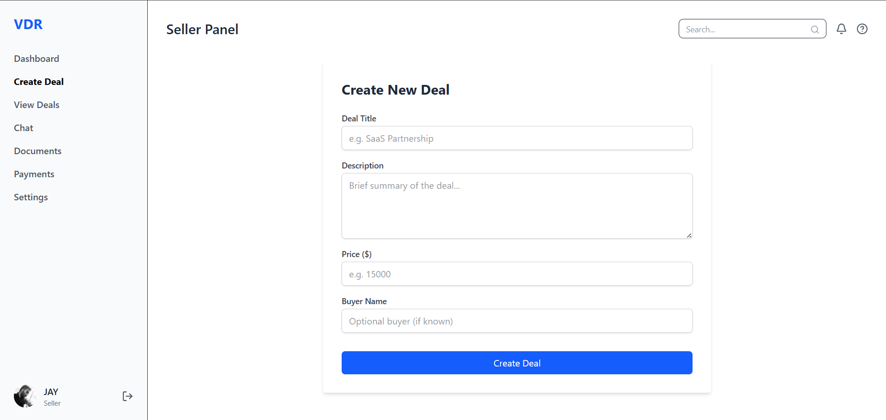

# 🧩 VDR Role-Based Dashboard (React + TailwindCSS)

A fully responsive role-based dashboard built with React and TailwindCSS. This project simulates a secure frontend login system and provides different dashboards for sellers (admins) and buyers (users) without a backend.

---

## 🔧 Setup Instructions

1. Clone the repository:

```bash
git clone https://github.com/Jay-kabdwal/VDM.git
cd client
npm install
npm run dev
Then visit: http://localhost:5173

```
---

🧱 Tech Stack Overview

1.React : UI library for building SPA
2.React Router DOM:	Routing between role-based views
3.Tailwind CSS: Utility-first CSS framework
4.Lucide React: Icon set for interface elements
5.Vite: Fast dev server and build tool
6.LocalStorage: Stores mock authentication state


## Images

Register page

Login page


Seller Dashboard


seller profile setting


Add deals


--explore other features : Visit the live site 👉 [Live Demo](https://vdm-ten.vercel.app/)


✨ Features
✅ Role-based Login (Admin vs User)

✅ Dashboard navigation

✅ Protected routes using React Router

✅ Create & View Deals

✅ Chat, Documents, Payments and Settings

✅ Profile & Logout functionality

✅ LocalStorage-based mock authentication

🚀 How It Works
Users register or login through the Auth page.

Their role is saved in localStorage.

ProtectedRoute guards ensure only proper roles access the right dashboard.

React Router <Outlet /> dynamically renders pages within AdminHome or UserHome.

Sidebar updates active state based on route.

-----

🎨 UI inspired by [Banani.ai](https://banani.ai)  
🤖 Code scaffolded with help from [ChatGPT](https://chat.openai.com)

-----

Made with ❤️ by Jay

